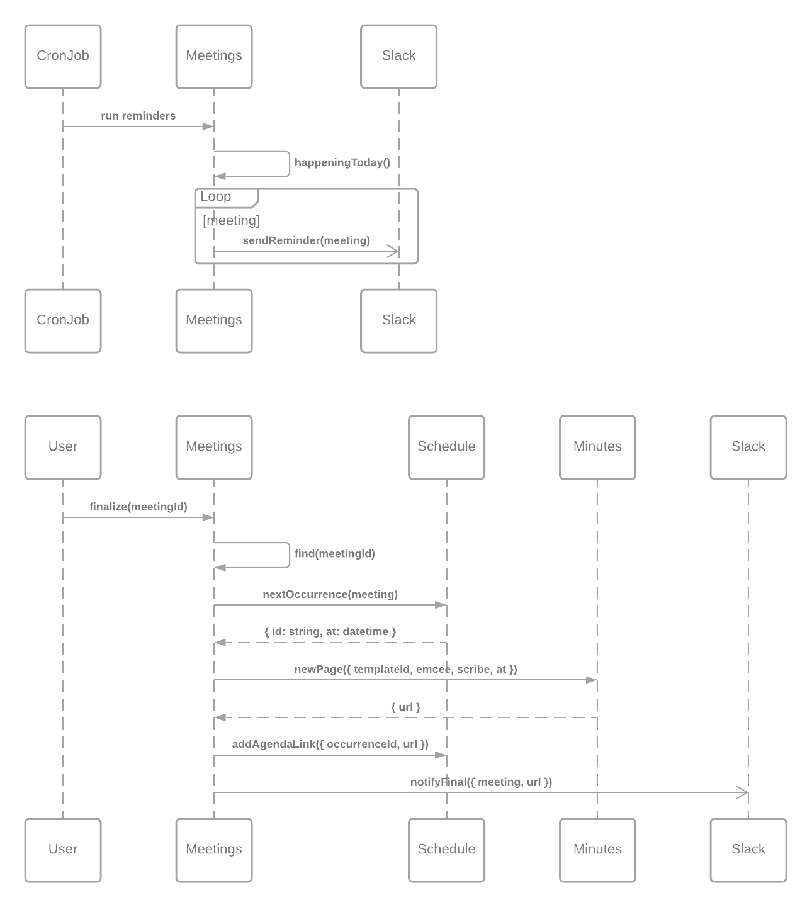

# Overview

`Friday` is an over-engineered yak shave to manage meetings with

- A recurring Google calendar invite
- Meeting notes for each week, generated from a template and linked in the calendar invite
- A rotating scribe and emcee amongst the meeting members
- Slack reminders sent out morning-of with reminders about any pre-reading

inspired by [Agile Log Book](https://agilelogbook.com/2017/07/08/automated-slack-reminders-for-your-meetings-with-google-apps-script/).

I'm developing this in support of a [JavaScriptLA Meetup presentation](https://javascriptla.net/blog/exploring-kubernetes-w-james-dabbs/). The notes for that are in [`./docs`](./docs), and I'll be posting a summary of the talk to my [blog](http://jdabbs.com/talks) once it's presented.

## Components

Each of these is a package in `packages/`

### `slack`

- [NestJS](https://nestjs.com/) Kafka microservice
- Posts messages to Slack's API
- Stateless

### `schedule`

- [NestJS](https://nestjs.com/) HTTP service
- Interacts with the Google Calendar API
- Stateless (for now)

### `minutes`

- [NestJS](https://nestjs.com/) HTTP service
- Interacts with the Confluence API
- Stateless

### `meetings`

- [NestJS](https://nestjs.com/) HTTP service
- Coordinates between the other services
- Persistence with [Prisma](https://www.prisma.io/)

### `nest-platform`

- Library containing shared Nest modules and utilities

### `infra`

- Contains [CDK8s constructs](https://cdk8s.io/) for declaring the application's `k8s` manifest

## Key Flows



# Running Locally

To fully run this example locally, you'll want to

## Initial Setup

### Install Your Tools

- A Kubernetes cluster (e.g. `kind`, `minikube` ... I'm using `Docker for Mac`)
- [`skaffold`](https://skaffold.dev/)

### Provision Namespace and Secrets

Secrets obviously aren't checked in to source code, but do need to be available to services running in the cluster.
You get them there by creating `k8s` resources of `kind: Secret` in the same namespace as the services consuming them.

I find it easiest to iterate by creating a stable `namespace` with its secrets out-of-band, and then letting `skaffold`
manage all the other resources in that `namespace`. YMMV, but an example:

```bash
$ kubectl create namespace friday
$ kubectl create secret generic minutes-secret -n friday --from-env-file=./packages/minutes/.env
$ kubectl create secret generic schedule-secret -n friday --from-env-file=./packages/schedule/.env
$ kubectl create secret generic slack-secret -n friday --from-env-file=./packages/slack/.env
```

Each service should have an `.env.example` file which documents the expected variables.

### Setup `.npmrc`

You'll need an `.npmrc` file which configures access to an NPM repo where `nest-platform` can be published and downloaded.
I'm using [Github's NPM registry](https://docs.github.com/en/packages/working-with-a-github-packages-registry/working-with-the-npm-registry) for this.

### (Optional) Configure Cluster Ingress

_Skip this if you're happy `port-forward`ing instead of using e.g. `http://meetings.localhost`_

Setup `ingress-nginx` following https://kubernetes.github.io/ingress-nginx/deploy, e.g.

```bash
$ kubectl apply -f https://raw.githubusercontent.com/kubernetes/ingress-nginx/controller-v0.47.0/deploy/static/provider/cloud/deploy.yaml
```

Then configure `dnsmasq` following https://banck.net/2018/12/using-dnsmasq-on-mac-os-for-local-development/, e.g.

Create / update `/etc/resolver/localhost` to

```
nameserver 127.0.0.1
```

Check with `scutil --dns` and ensure `localhost` appears, then

```bash
$ brew install dnsmasq
$ sudo brew services start dnsmasq
$ echo "listen-address=127.0.0.1" >> $(brew --prefix)/etc/dnsmasq.conf
$ echo "address=/.localhost/127.0.0.1" >> $(brew --prefix)/etc/dnsmasq.conf
$ sudo brew services restart dnsmasq
```

and update DNS servers if needed, e.g. https://www.macinstruct.com/tutorials/how-to-change-your-macs-dns-servers/

## Development

### On Applications

Run

```bash
$ skaffold dev
```

Changes will be automatically synced.

### On Libraries (e.g. `@jamesdabbs/nest-platform`)

- Keep `skaffold dev` running
- Make changes in the libary
- Bump the version in the libraries `package.json` (using an `-alpha#` or `-rc#` if desired)
- Run `npm publish`
- Update the version in the consumer(s)

At this point, `skaffold` should pick up the changes, rebuild the relevant containers, and redeploy.

### On `k8s` Components

- Keep `skaffold dev` running
- Run `npm run start:dev` in the `packages/infra` directory
- Make changes to the CDK8s constructs

Changes will trigger a manifest build and thus a re-deploy.

You can run unit tests against the constructs with `npm run test` or `test:watch`. Note that - in the current workflow - tests do _not_ have to pass before `skaffold` attempts a deploy.
